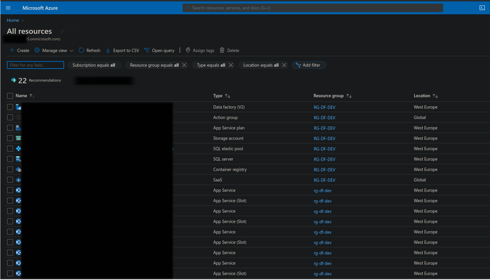
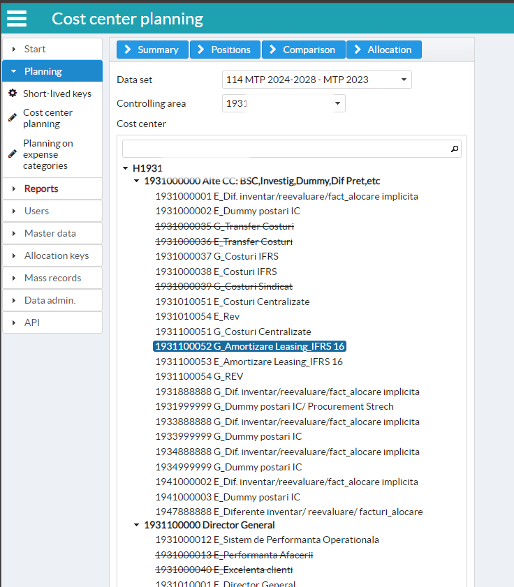
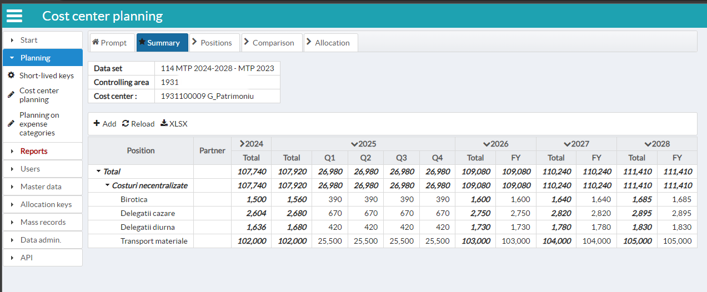
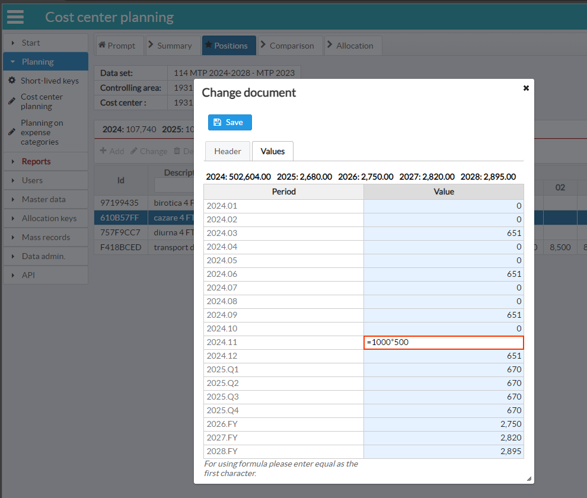
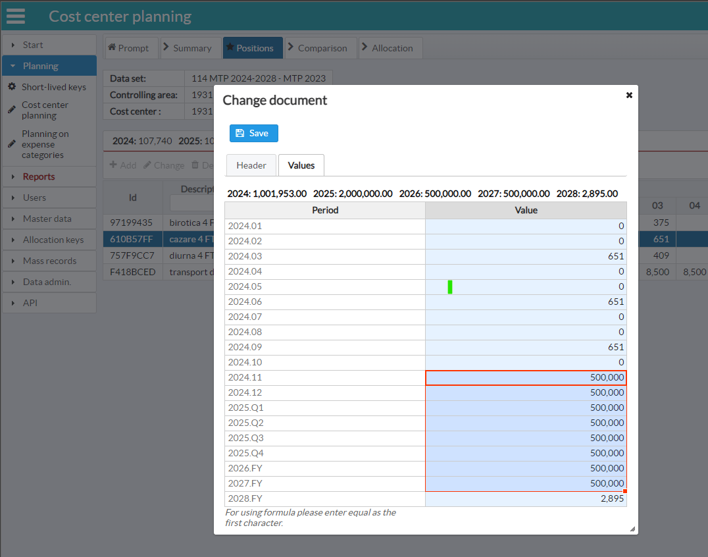

# Java Enterprise Edition Application for budget planning for the cost center managers in the organization

## Status
- Minimal Viable Product
- used in production by a big corporate company for more than 4 year as of now

## Features
- OpenID Connect login for MS Azure AAD
- Dockerized with private repository
- Azure DevOps CI/CD
- Secured REST endpoint for data extraction (e.g. MS Power Query)
- Cloud based
- .xlsx/ .csv/ .txt files upload/ download
- MS SQL server backend
- Bilingual UX
- Responsive UX

## Dependencies
- Glassfish Application Server
- Nimbus
- JDBC (no ORM)
- Apache POI
- JavaFaces
- Weld CDI
- Docker
- HandsOnTable (for data entry)

# Screenshots

### Cloud resource overview

### Select planning object prompt

### Planned values summary

### Plan new record using formula for values

### Plan new record, drag value for all periods
